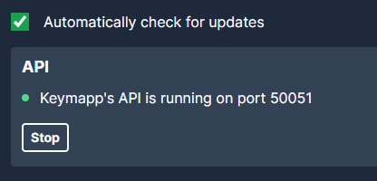

# zsa-keymapp-python

Control your ZSA keyboard (Moonlander / Voyager / Ergodox) using the [Keymapp](https://blog.zsa.io/keymapp/) API (Protobuf) in Python.

See also a Talon implementation https://github.com/ohare93/zsa-keymapp-talon for voice and foot-pedal control of your keyboard layers.

## Installation

This repo uses poetry as a package manager and Python 3.12 (though older versions may work fine).

1. Install the dependencies in the pyproject.toml

```sh
poetry install
```

2. Generate the Protobuf API code from the keymapp.proto file

```sh
poetry run python -m grpc.tools.protoc -I. --proto_path . --python_out . --mypy_out . --grpc_python_out . ./protos/*.proto
```

Any .proto files in the protos/ folder will be used for generation.

## Usage

Ensure your Keymapp API is enabled in the application,



Run it:

```sh
poetry run python keymapp.py
```

This will change the keyboard layer to the 2nd layer (layer 1!). Change the code in keymapp.py to do whatever you like 🎉 Set the layer, increase the brightness, change led colours in your keyboard. See protos/keymapp.proto for the valid endpoints. 

See also:
- [Kontroll](https://github.com/zsa/kontroll) a command-line tool written in Rust to interact with the Keymapp API. (Where the keymapp.proto file was taken from)
